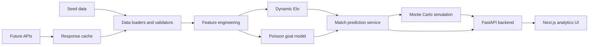

# World Cup 2026 Prediction Platform Architecture

## Requirement Analysis

The product is a sports analytics web application for World Cup 2026 knockout predictions from the Round of 32 onward. The first production milestone is an explainable MVP that can run without paid data feeds while leaving clear extension points for live fixtures, injuries, squads, weather, and richer player data.

Core product capabilities:

- Browse knockout fixtures and predicted scorelines.
- View win, draw, upset, and advancement probabilities.
- Compare team strength, form, attack, and defense.
- Inspect model explanations rather than only final predictions.
- Run Monte Carlo tournament simulations.
- Continue operating when third-party APIs fail by using cached and seed datasets.

## Data Source Assessment

Recommended source strategy:

| Domain | Free option | Paid option | Decision |
| --- | --- | --- | --- |
| Fixtures and results | football-data.org free tier, Kaggle historical results, openfootball | Sportmonks, API-Football, Opta/Stats Perform | Start with seed fixtures and cached public results. Add paid provider adapter later. |
| Elo baseline | eloratings.net exports, public historical match datasets | Opta/Stats Perform | Build local Elo engine from match results so the methodology is auditable. |
| Team metadata | FIFA rankings pages, Wikidata, openfootball | Sportmonks | Use seed metadata for MVP; normalize future provider payloads. |
| Squad quality | Transfermarkt-derived public datasets may be legally fragile | Wyscout, Opta, StatsBomb, Sportmonks | Keep optional adjustment interface; avoid scraping as a core dependency. |
| Weather | Open-Meteo, NOAA | Tomorrow.io, Visual Crossing | Use Open-Meteo-compatible adapter later because it has a generous free tier. |
| Injuries | Sparse and inconsistent free data | Sportmonks, API-Football, Rotowire style feeds | Design future adjustment hooks; do not fake live injury precision. |

The MVP uses `data/seed` for deterministic operation. External providers should write to `data/raw`, normalized tables should write to `data/processed`, and API responses should be cached in `data/cache` with TTL metadata.

## System Architecture

Backend modules:

- `core`: settings, logging, constants, and path resolution.
- `data`: typed loaders for teams, fixtures, and historical matches.
- `models`: Pydantic schemas used by the API.
- `services`: Elo, feature engineering, Poisson score modeling, match predictions, and tournament simulation.
- `api`: route definitions and dependency wiring.

Frontend modules:

- App Router pages for home, bracket, match detail, team detail, and methodology.
- Componentized analytics cards, probability bars, scoreline tables, and bracket panels.
- API client isolated in `frontend/lib/api.ts` so deployment can point to hosted backend URLs.

## Prediction Methodology

1. Team strength starts with seed Elo and is updated from historical matches.
2. Recent form uses exponential time decay and competition weights.
3. Expected goals combine attack strength, defense strength, Elo difference, form, and neutral venue assumptions.
4. The score matrix evaluates 0-0 through 6-6 using independent Poisson distributions.
5. Match winners are sampled from score probabilities. Draws in knockout matches are resolved by a penalty-weighted team strength tiebreak.
6. Tournament simulations repeat bracket resolution and aggregate round and champion rates.

This is intentionally transparent. The platform can improve by calibrating coefficients against historical tournaments, but the MVP avoids opaque black-box predictions.

## Technical Decisions

- **FastAPI and Pydantic**: provide typed contracts and automatic OpenAPI documentation.
- **Next.js with TypeScript**: gives production deployment paths on Vercel and a strong UI development model.
- **TailwindCSS**: keeps design iteration fast without inventing a design system.
- **Local seed data first**: makes tests and demos reliable before external API contracts are finalized.
- **Explainable hybrid model**: gives users a reason trail for predictions, which is more useful than a single probability.
- **Monte Carlo service with configurable runs**: supports fast UI previews and heavier production simulations.

## Development Roadmap

1. Planning and architecture artifacts.
2. Backend data models, seed loaders, prediction engine, API routes, and tests.
3. Frontend analytics UI for home, bracket, match, team, and methodology pages.
4. DevOps assets: Docker, Compose, CI, environment documentation, deployment guide.
5. Provider adapters for fixtures/results and cache invalidation.
6. Model calibration against historical international match datasets.
7. Optional squad, climate, and injury adjustment integrations.

## Production Risks

- The official knockout bracket is not known until the group stage completes. The seed bracket is a scenario dataset.
- Injury and squad value feeds are usually paid or licensing-sensitive.
- A Poisson model assumes independent scoring processes; this is explainable but imperfect for tactical match states.
- A 100,000-run simulation can be expensive for synchronous requests. The API supports configurable runs so production can move heavy jobs to a worker.
